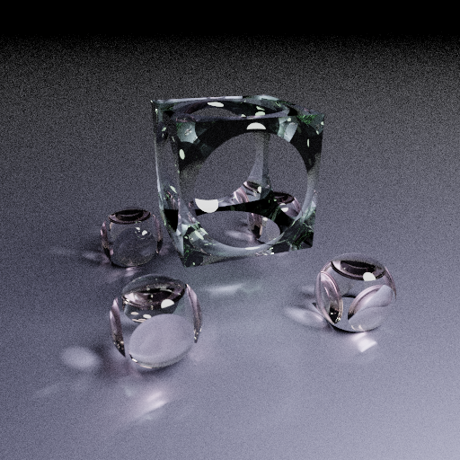

# raytrace

A simple raytrecer written in Rust

It is strongly advised to build this program in release mode even if you are only debugging due to performance reasons.

To build, run:

```
cargo run --release > path/image_name.ppm
```


